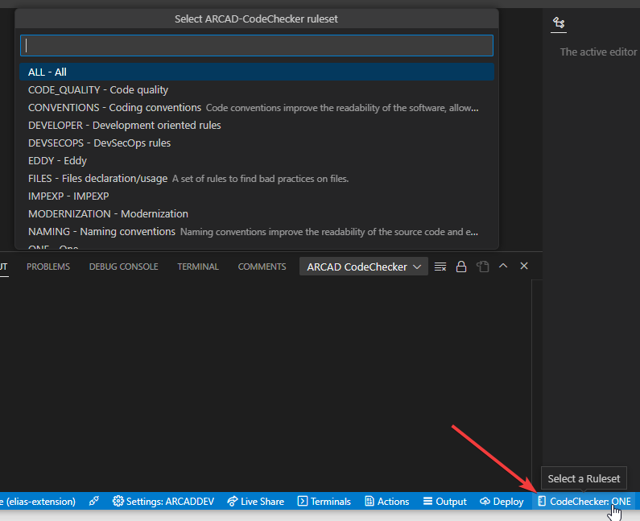
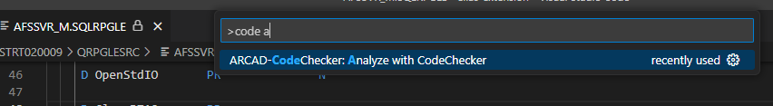
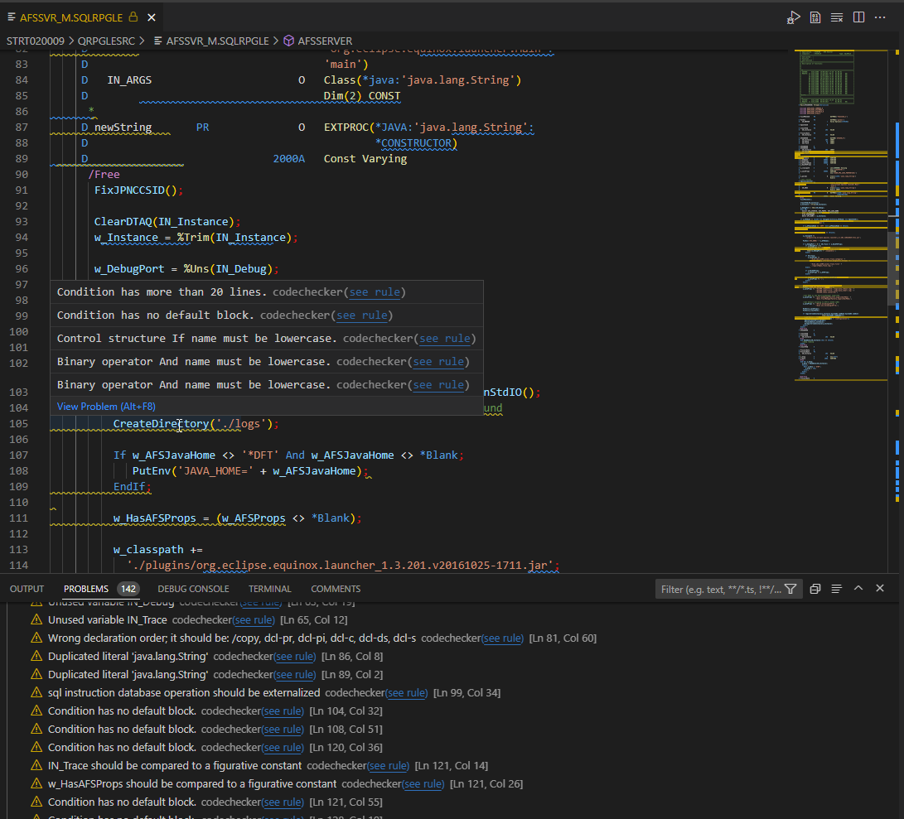

# ARCAD-CodeChecker VSCode extension

Check your IBM i source and detect issues before they make it to production!

## Features
- Select the `Rule Set` to use using the `CodeChecker` status bar item or command palette

- Analyze the source you're working on using the `Analyze with CodeChecker` command or right-click menu action

- Issues are highlighted in the source editor and listed in the `Problems` view
