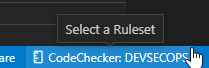

# Getting Started
1. Download and install the `ARCAD-CodeChecker` extension from the VSCode marketplace.
2. Open the `Settings`, navigate to the `extension` > `ARCAD-CodeChecker` section and set the server's address and port. 

3. If you use `HTTPS`, make sure to set the path to a local file containing the server's certificate chain in `PEM` format. 

4. Click on the `CodeChecker` status bar icon and select the desired RuleSet 

5. Open a source file, right click and select `Analyse with CodeChecker` 
6. Detected issues will be higlighted and listed in the `Problems` view